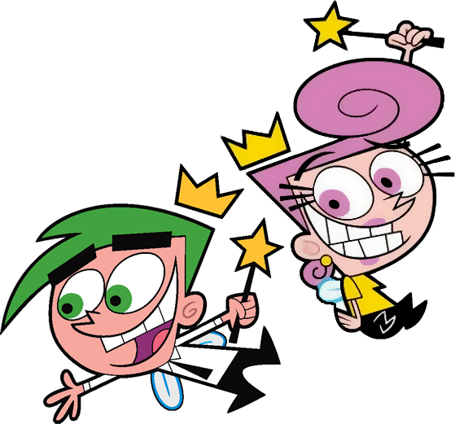

# 🪄 Padrinhos Mágicos

<h4>Este projeto foi criado como parte das aulas para aplicar os conceitos aprendidos durante o curso. Uma página temática dos Padrinhos Mágicos, desenvolvida utilizando HTML e SASS. Embora não tenha funcionalidades interativas, o foco está na estruturação correta do código, estilização e boas práticas de desenvolvimento</h4>

## 🚀 Tecnologias Utilizadas
- HTML
- SASS

  

